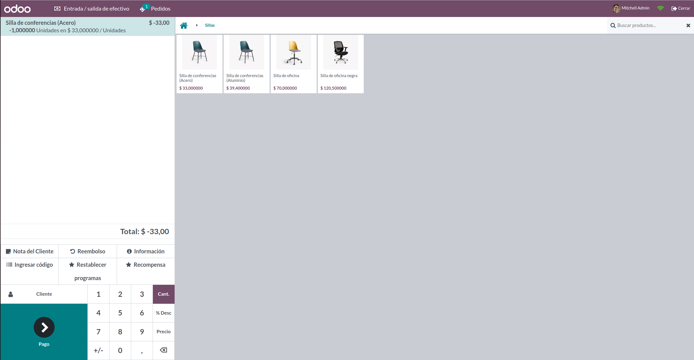
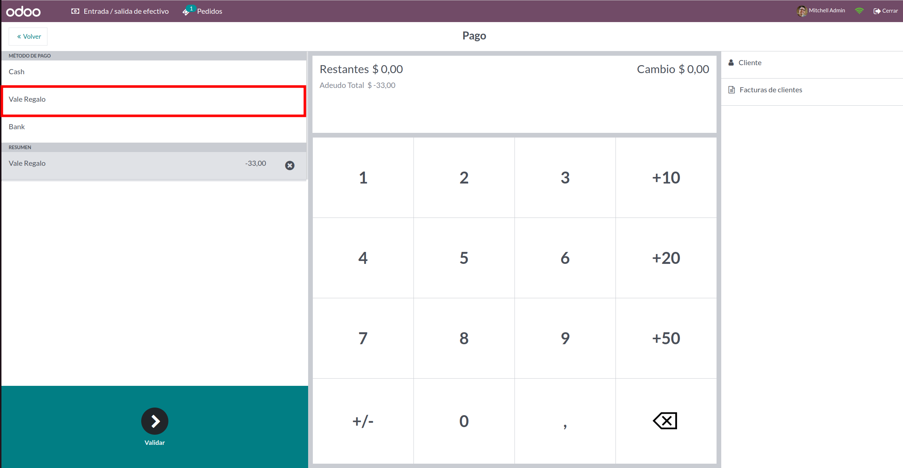
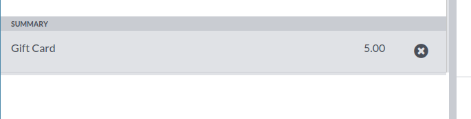

Please carefully review the documentation of the module "pos_loyalty_redeem_payment" to understand how this basic
module works for the proper use of this module.

This module allows Odoo users to create return purchase vouchers as gift cards for future POS sales.

At the end of the return, select the payment method that you set as "Used for loyalty programs".

A new payment line is added with selected amount:

After order is completed, loyalty card report is downloaded with updated
points.
